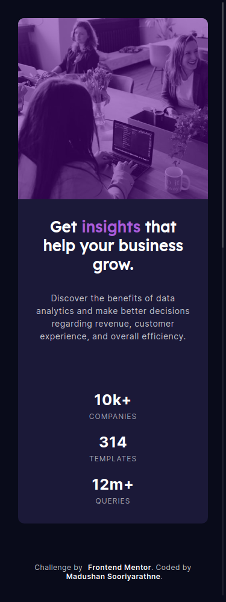

# Frontend Mentor - Stats preview card component solution

This is a solution to the [Stats preview card component challenge on Frontend Mentor](https://www.frontendmentor.io/challenges/stats-preview-card-component-8JqbgoU62). Frontend Mentor challenges help you improve your coding skills by building realistic projects.

## Table of contents

- [Overview](#overview)
  - [The challenge](#the-challenge)
  - [Screenshot](#screenshot)
  - [Links](#links)
- [My process](#my-process)
  - [Built with](#built-with)
- [Author](#author)
- [Acknowledgments](#acknowledgments)

## Overview

### The challenge

Users should be able to:

- View the optimal layout depending on their device's screen size

### Screenshot

#### Desktop Preview

#### Mobile Preview

### Links

- Solution URL: [Github](https://github.com/madushan-sooriyarathne/frontend-mentor-stat-preview-card-challange)
- Live Site URL: [Netlify](https://stat-card.netlify.app/)

## My process

### Built with

- Semantic HTML5 markup
- Sass

## Author

- Website - [Madushan Sooriyarathne](https://madushan.dev)
- Frontend Mentor - [@madushan-sooriyarathne](https://www.frontendmentor.io/profile/madushan-sooriyarathne)
- Github - [@madushan-sooriyarathne](https://github.com/madushan-sooriyarathne)
